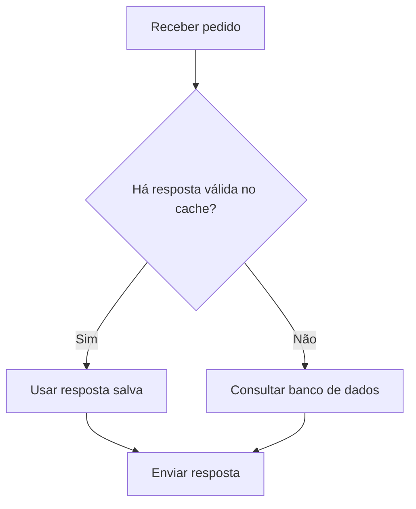

# Linguagem técnica simples

Consulte quando precisar de exemplos de simplificação, diagramas ou redução de texto.

## Cortar sem perder informação

Antes:

> Para que seja possível dar continuidade ao processo de cadastro, é necessário que você realize a confirmação do seu endereço de e-mail por meio do link enviado.

Depois:

> Confirme seu e-mail pelo link enviado para continuar o cadastro.

A versão curta mantém a ação, o meio e a finalidade.

## Explicar o termo necessário

Antes:

> A cobrança é idempotente para requisições com a mesma chave.

Depois, para quem não conhece o termo:

> Repetir o pedido com a mesma chave não gera outra cobrança. Esse comportamento se chama idempotência.

A explicação cresceu, mas ficou mais clara. Preserve a condição "com a mesma chave". Não substitua o termo por uma ideia vaga, como "segurança".

## Mostrar um fluxo

Use um diagrama quando as alternativas forem mais fáceis de acompanhar visualmente:

O cache guarda respostas para reutilização. Se houver uma resposta válida salva, o sistema a envia. Caso contrário, consulta o banco de dados.

Se o ambiente não renderizar Mermaid, use um esquema em texto com as mesmas condições. Uma instrução simples, como "Salve o arquivo", dispensa diagrama.

## Conferir a redução

Compare as versões completas pelo mesmo critério. Inclua as palavras dos rótulos do diagrama, sem contar sua sintaxe. Guarde as contagens na revisão interna.

Prefira a versão menor quando ambas explicarem a mesma coisa. Se um corte esconder uma condição ou exigir conhecimento que o leitor não tem, restaure a explicação.

## Fonte e adaptação

[Guia prático do português simplificado para documentos acessíveis](https://iparadigma.org.br/wp-content/uploads/2025/10/Guia_pratico_do_portugues_simplificado_digital.pdf). Mirella Balestero et al. Ibict, 2023. Licença CC BY 4.0.

Páginas de referência: 16, 28, 34 e 38 a 43. O guia orienta a escolha de palavras, a explicação de termos e a ligação entre ideias. Os exemplos acima são próprios da PT-BR. A preferência por diagramas e a checagem de tamanho são adaptações desta skill.
